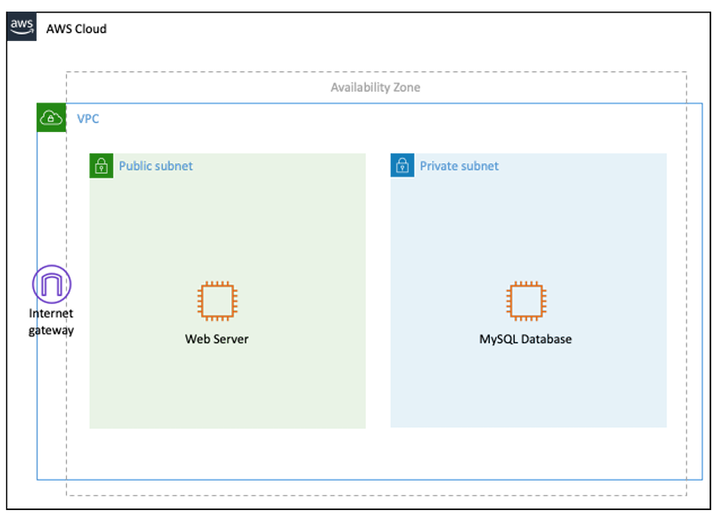

# Módulo 7: Arquitectura de 2 Capas en AWS

## Objetivo

El objetivo de este desafío será crear una arquitectura simple de 2 capas y verificar que la conexión entre capas funciona de manera correcta. Para la misma, tendrán que seguir el siguiente diagrama realizado luego de una migración “Lift and Shift” a AWS de una de las aplicaciones web de nuestro cliente.



## Desafío

### Servidor Web

1. **Crear una instancia EC2 dentro de los parámetros de free tier**:
    - Configurar la conexión remota, la misma podrá ser a través de SSM, utilizando la llave de SSH y conectarnos desde nuestra VM con Linux, etc. A elección de ustedes. Una vez configurado, verifiquen la conexión.
2. **Instalar un webserver**:
    - Utilizar userdata o conectarse a la instancia, habilitar el servicio y verificar que el webserver funciona de forma local (utilizando `curl` por ejemplo) y de forma remota (accediendo desde el navegador de nuestra PC o celular). Es importante verificar security groups y firewalls para asegurarse de poder acceder de forma remota al puerto que expone el webserver.

### Base de Datos

1. **Crear una instancia de RDS (free tier)**:
    - Configurarla de forma tal que sólo tengamos acceso desde la instancia de webserver, que no esté abierta al público.
2. **Simular el acceso a la base de datos desde la aplicación web**:
    - En este caso, nuestra aplicación no accederá a la base de datos pero simularemos el mismo ejecutando un comando para conectarnos a la base de datos. Por ejemplo, en caso de utilizar MySQL como motor de la instancia de RDS, usaremos el comando:
      ```sh
      mysql -h <endpoint> -P 3306 -u <usuario> -p
      ```

Al final del desafío, deberían contar con una arquitectura similar a la diagramada al principio del desafío:
- Un webserver (accesible a todo público)
- Una base de datos (accesible solamente a través de la instancia del webserver)

Recordar documentar todos los pasos principalmente las medidas de seguridad y security groups creados para configurar de forma correcta los accesos a los servicios. Documentar también la eliminación de los recursos creados una vez finalizado el desafío.