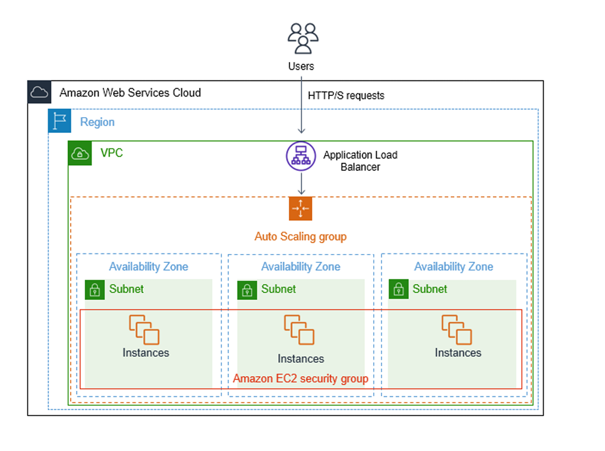

# Módulo 8: Configuración de VPC, Autoscaling y Load Balancer

## Objetivo

El objetivo de este desafío es crear una VPC junto con los recursos necesarios para tener redes públicas y privadas. Además, configuraremos un Autoscaling Group, un Launch Template y un Load Balancer. En el Launch Template, configuraremos un servidor web sencillo en la sección de userdata para que en un encabezado nos muestre el hostname de la instancia.

## Diagrama de Arquitectura

Para una mejor comprensión de la arquitectura que se implementará, consulta el siguiente diagrama:



## Desafío

### VPC

1. **Crear una VPC**:
   - Configurar 3 subnets públicas y 3 privadas (en 3 AZs).
   - No utilizar NAT Gateway ni VPC Endpoints.
   - Habilitar las dos opciones de DNS.

2. **Crear una tabla de subnets**:
   - Incluir la información de cada subnet (Subnet-ID, tipo de subnet y CIDR).

### Launch Template

1. **Configurar el Launch Template**:
   - Utilizar la imagen de Ubuntu.
   - El tipo de instancia debe ser `t2.micro` (free tier).
   - Incluir un keypair para conectarse a las instancias.
   - Utilizar un Security Group que permita acceso por SSH y HTTP.
   - En la configuración de red avanzada, auto-asignar una IP pública a cada instancia.
   - En la sección de userdata, instalar un webserver y agregar la siguiente línea:
     ```bash
     echo "<h1>Hola desde $(hostname -f)</h1>" > /var/www/html/index.html
     ```

### Autoscaling Group

1. **Configurar el Autoscaling Group**:
   - Utilizar el Launch Template creado.
   - Usar las subnets públicas.
   - Crear un Load Balancer de tipo internet-facing (Application Load Balancer).
   - Crear un Target Group.
   - Habilitar health checks en el Load Balancer.
   - Configurar la capacidad deseada en 3 instancias.
   - Configurar la capacidad mínima en 1 instancia.
   - (Opcional) Configurar políticas de escalado.

### Documentación

- **Propósito de los Componentes**:
  - **Load Balancer**: Distribuye el tráfico entre instancias para asegurar alta disponibilidad y escalabilidad.
  - **Launch Template**: Define la configuración de instancias y permite lanzar instancias con esta configuración predefinida.
  - **Autoscaling Group**: Maneja la escalabilidad automática de instancias según la demanda.
  - **Target Group**: Agrupa instancias y configura el Load Balancer para dirigir el tráfico a estas instancias.

- **Instructivo**:
  - Incluir capturas de pantalla que demuestren el acceso a cada instancia:
    - Utilizando herramientas como `curl` en la terminal.
    - Accediendo a la página web desde un navegador.

- **Documentación Adicional**:
  - Documentar todos los pasos, incluyendo medidas de seguridad y configuraciones de Security Groups.
  - Documentar la eliminación de los recursos creados una vez finalizado el desafío.
